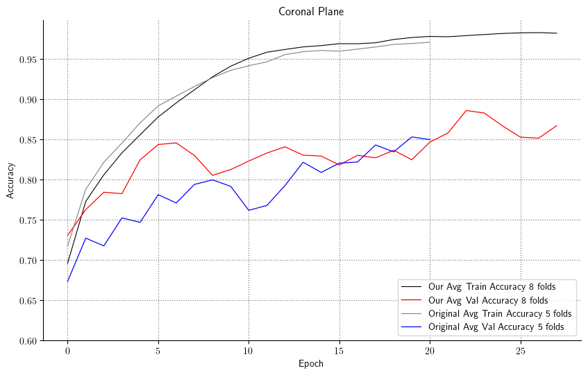
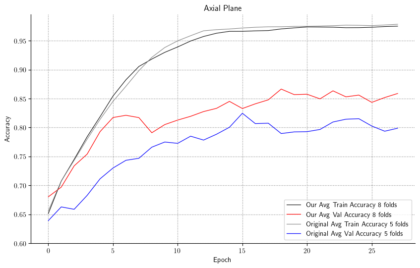
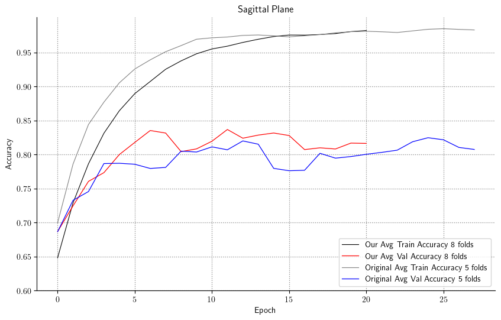
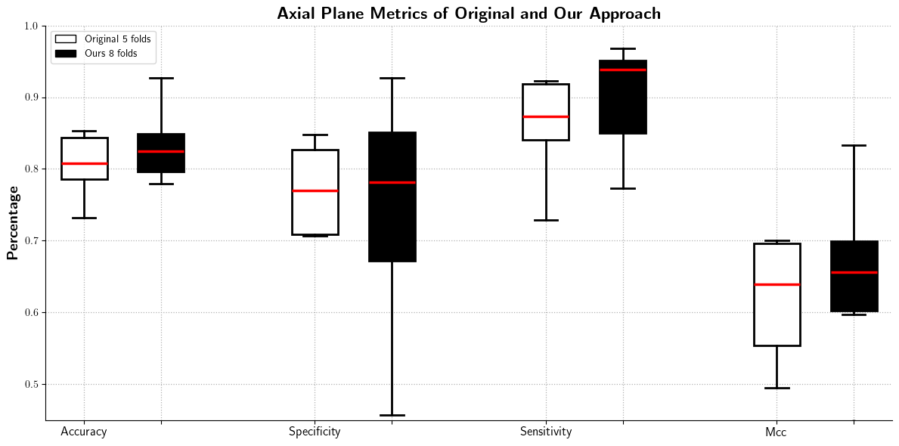
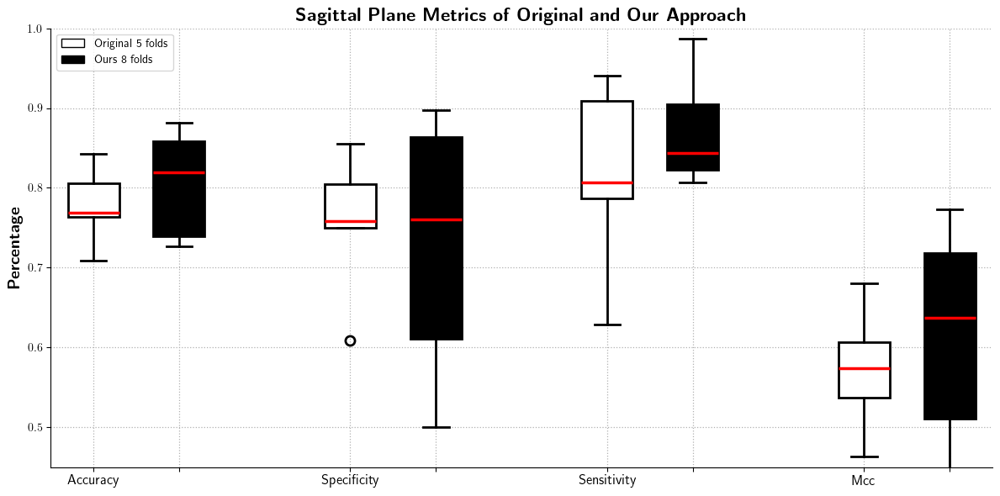
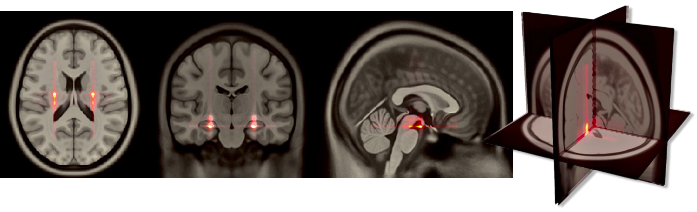
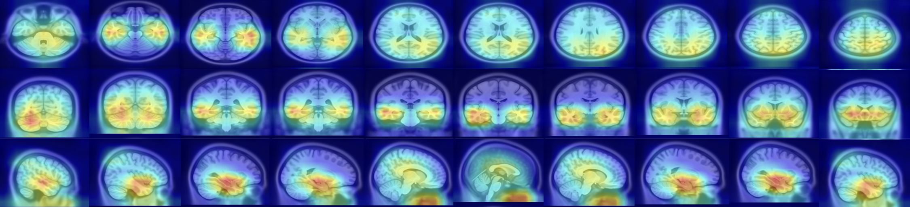

# AXIAL Replication for Numerical Analysis for Machine Learning Course

This repository contains the project for the "Numerical Analysis for Machine Learning" course, focused on replicating and extending the results presented in the **AXIAL paper** for explainable Alzheimer's disease prediction: [AXIAL: Attention-based eXplainability for Interpretable Alzheimer's Localized Diagnosis using 2D CNNs on 3D MRI brain scans](https://arxiv.org/abs/2407.02418)


## Project Overview

The goal of this project was to reproduce the findings of the AXIAL paper by following a similar methodology, leveraging publicly available data and high-performance computing resources. We aimed to understand and implement the techniques used for predicting Alzheimer's disease while emphasizing model explainability. Beyond simple replication, we explored hyperparameter tuning and methodological adjustments to improve upon the original model's performance.

The project report is available in [docs/NAML.pdf](docs/NAML.pdf)

## Methodology

The replication process involved the following key steps:

1.  **Data Acquisition**: Data was downloaded from the Alzheimer's Disease Neuroimaging Initiative (ADNI) dataset.
2.  **Data Preprocessing**:
    *   Initial preprocessing of neuroimages was performed using the Clinica software toolkit.
    *   Further custom preprocessing steps for data curation and preparation were implemented using Python scripts.
3.  **Model Training**:
    *   The model was first trained using the best configuration specified by the authors of the original AXIAL paper and then retrained with our optimized hyperparameters.
    *   Training was performed on the **JEDI cluster** at the Jülich Supercomputing Centre, utilizing NVIDIA GH200 GPUs to handle the computational demands.
4.  **Model Evaluation**:
    *   The model's performance was evaluated on a held-out test set using an 8-fold cross-validation strategy.
    *   Standard classification metrics such as **Accuracy (ACC), Specificity (SPE), Sensitivity (SEN), and Matthews Correlation Coefficient (MCC)** were calculated.
    *   The results were compared against the original paper's reported metrics.


## Getting Started

Follow these instructions to set up the environment and run the experiments.

### HPC Environment Disclaimer

**Important**: The entire workflow, from preprocessing to training, was developed and tested on the **JEDI High-Performance Computing (HPC) cluster**. The process requires significant computational resources (specifically, high-VRAM GPUs. The cluster mounts NVIDIA GH200 accelerators) and storage for the processed ADNI dataset. **Replication on a standard local machine (e.g., a laptop or desktop) may not be feasible** due to GPU memory limitations, long training times, and large data storage requirements.

## Replication Steps
   ### ADNI Data Download

1. Subscribe to the ADNI website at [https://ida.loni.usc.edu/login.jsp](https://ida.loni.usc.edu/login.jsp).

2. Download the desired ADNI image collection. In the case of this work, the image collection name is "ADNI1 Complete
   1Yr 1.5T".

### Clinical Data Download

1. On the ADNI website, click on "Download" and then select "Study Data".

2. Choose "ALL" to download all available data.

3. In the "Tabular Data (CSV format)" section, select all the files and download them.

### Rename CSV Files

Some CSV files in the clinical data may have a date at the end of their name. Remove the date from the file names to
ensure compatibility with the preprocessing pipeline.

### Install Clinica Software

Install the Clinica software by following the instructions provided
at [https://aramislab.paris.inria.fr/clinica/docs/public/latest/Converters/ADNI2BIDS/](https://aramislab.paris.inria.fr/clinica/docs/public/latest/Converters/ADNI2BIDS/).
Clinica is a powerful tool that facilitates
the conversion of ADNI data to the BIDS structure.

### Convert ADNI to BIDS

To convert the ADNI data to the BIDS structure, use the following command:

```bash
clinica convert adni-to-bids -m T1 DATASET_DIRECTORY CLINICAL_DATA_DIRECTORY BIDS_DIRECTORY
```

Replace `DATASET_DIRECTORY` with the path to the downloaded ADNI dataset, `CLINICAL_DATA_DIRECTORY` with the path to the
downloaded clinical data, and `BIDS_DIRECTORY` with the desired output path for the BIDS-formatted dataset. The `-m T1`
option specifies that only MRI data with T1 weighting should be converted.

## Preprocessing

This section describes the preprocessing steps for the sMRI data.

### Run Preprocessing Pipeline

To run the preprocessing pipeline on the sMRI data, execute the following command:

```bash
python data_preprocessing.py --bids_path /path/to/bids-dataset --n_proc 10 --checkpoint checkpoint.txt
```

Replace `/path/to/bids-dataset` with the path to the BIDS-formatted dataset obtained from the data preparation steps.
The preprocessing pipeline includes MNI152 registration, brain extraction, and bias field correction with the N4
algorithm. The preprocessed images will be stored in the same path as the original images.

The `n_proc` argument specifies the number of processes to be used for the preprocessing pipeline.

The `checkpoint`argument specifies the path to the checkpoint file, which is used to keep track of the images that have
already been preprocessed. This allows the preprocessing pipeline to be interrupted and resumed later.

Please note that the preprocessing step is time-consuming and may take a significant amount of time to complete.

2.  **Model Training**
    To start training, run the main training script. Model configurations can be adjusted in `configs/best_config.json`.
    ```bash
    python train.py --config configs/best_config.json
    ```

3.  **Model Evaluation**
    Once training is complete, evaluate the model on the test set:
    ```bash
    python src/evaluate.py --model_path results/models/best_model.pth --data_dir data/processed
    ```

## Results

This section details the experimental setup, hyperparameter tuning, and a comparative analysis of our results against the original AXIAL paper.

### Experimental Setup and Hyperparameter Tuning

Training was performed on the JEDI cluster at the Jülich Supercomputing Centre. We first tested the model using the best configuration from the original paper and then modified it to achieve better results, particularly to address overfitting on our smaller dataset (<400 patients).

The key modifications were:
*   **Increased Cross-Validation Folds**: We increased `k_folds` from 5 to 8, allowing the model to train on a larger portion of the data in each iteration, which helps in generalizing better.
*   **Reduced Slice Input**: We reduced `num_slices` from 80 to 60, focusing on the most informative central slices. This reduced the risk of overfitting and accelerated training to fit within the cluster's 6-hour time limit.
*   **Regularization and Learning Rate**: We increased `dropout` and reduced the `learning_rate` to further combat overfitting.

The table below compares the original and our final hyperparameter configurations.

| Hyperparameter               | Original Values | Final Values |
| :--------------------------- | :-------------- | :----------- |
| `num_epochs`                 | 100             | 30           |
| `batch_size`                 | 8               | 8            |
| `dropout`                    | 0.3             | **0.5**      |
| `k_folds`                    | 5               | **8**        |
| `num_slices`                 | 80              | **60**       |
| `learning_rate`              | 0.0001          | **0.00005**  |
| `weight_decay`               | 0.01            | 0.01         |
| `freeze_first_percentage`    | 0.5             | **0.3**      |
| `optimizer`                  | AdamW           | AdamW        |
| `patience` (Early Stopping) | 20              | **10**       |

> **A Note on Data Leakage**: When using cross-validation, it is critical to perform data splitting correctly. An improper split can lead to **data leakage**, where subjects from the training set appear in the validation set. This can artificially inflate performance metrics and give a false sense of model accuracy. Our implementation ensures subject-level separation between folds.

### Performance Analysis

All reported results are averaged across the 8 folds of our cross-validation. Clinically, the coronal and axial planes are most critical for AD diagnosis, as they provide clear views of hippocampal atrophy.

As shown in the table below, our optimized approach consistently outperforms the original model in **Accuracy (ACC)**, **Sensitivity (SEN)**, and **Matthews Correlation Coefficient (MCC)** across all three anatomical planes.

| Plane    | ACC&nbsp;(Ours) | ACC&nbsp;(Original) | SPE&nbsp;(Ours) | SPE&nbsp;(Original) | SEN&nbsp;(Ours) | SEN&nbsp;(Original) | MCC&nbsp;(Ours) | MCC&nbsp;(Original) |
|----------|---------------:|--------------------:|---------------:|--------------------:|---------------:|--------------------:|---------------:|--------------------:|
| Coronal  | **85.30 %**    | 80.63 %            | 78.21 %        | **83.23 %**        | **91.02 %**    | 79.60 %            | **69.24 %**    | 63.45 %            |
| Axial    | **84.17 %**    | 80.92 %            | 75.33 %        | **77.42 %**        | **89.91 %**    | 83.45 %            | **66.32 %**    | 61.81 %            |
| Sagittal | **81.79 %**    | 78.25 %            | 73.21 %        | **74.65 %**        | **86.73 %**    | 80.44 %            | **61.13 %**    | 55.53 %            |

The **coronal plane** achieved the highest accuracy (85.30%) and excelled in sensitivity (91.02%), confirming its diagnostic value. While our model shows slightly lower **specificity** (correctly identifying healthy subjects), this trade-off is often acceptable in a clinical setting. **Higher sensitivity is paramount**, as it minimizes the risk of false negatives (missing a diagnosis), which is crucial for early intervention.

### Visualizations

The accuracy curves demonstrate stable model convergence. The box plots of the test metrics highlight the improved performance and consistency of our model across the cross-validation folds compared to the baseline.

**Accuracy curves for each anatomical plane on test and validation sets.**
| Coronal Plane                                        | Axial Plane                                              | Sagittal Plane                                             |
| :--------------------------------------------------: | :------------------------------------------------------: | :--------------------------------------------------------: |
|  |  |  |

**Test Metrics Box Plots (Across Folds)**
| Coronal Plane                                    | Axial Plane                                              | Sagittal Plane                                             |
| :----------------------------------------------: | :------------------------------------------------------: | :--------------------------------------------------------: |
|  |  |  |

### Explainability
Mean 3D attention map from the entire dataset overlaid on the MNI152
template using Axial3D (VGG16).


GradCAM++ visualization of 10 slices for each plane selected randomly


## Acknowledgements


*   The authors of the original AXIAL paper for their foundational work.
*   The Alzheimer's Disease Neuroimaging Initiative (ADNI) for providing the data.
*   The Clinica team for their invaluable software toolkit.
*   The Jülich Supercomputing Centre for providing access to the JEDI cluster, which was instrumental for this project.

## Course Information

*   **Course**: Numerical Analysis for Machine Learning (NAML) 2024/2025
*   **Institution**: Politecnico di Milano
*   **Instructor**: Prof. Edie Miglio